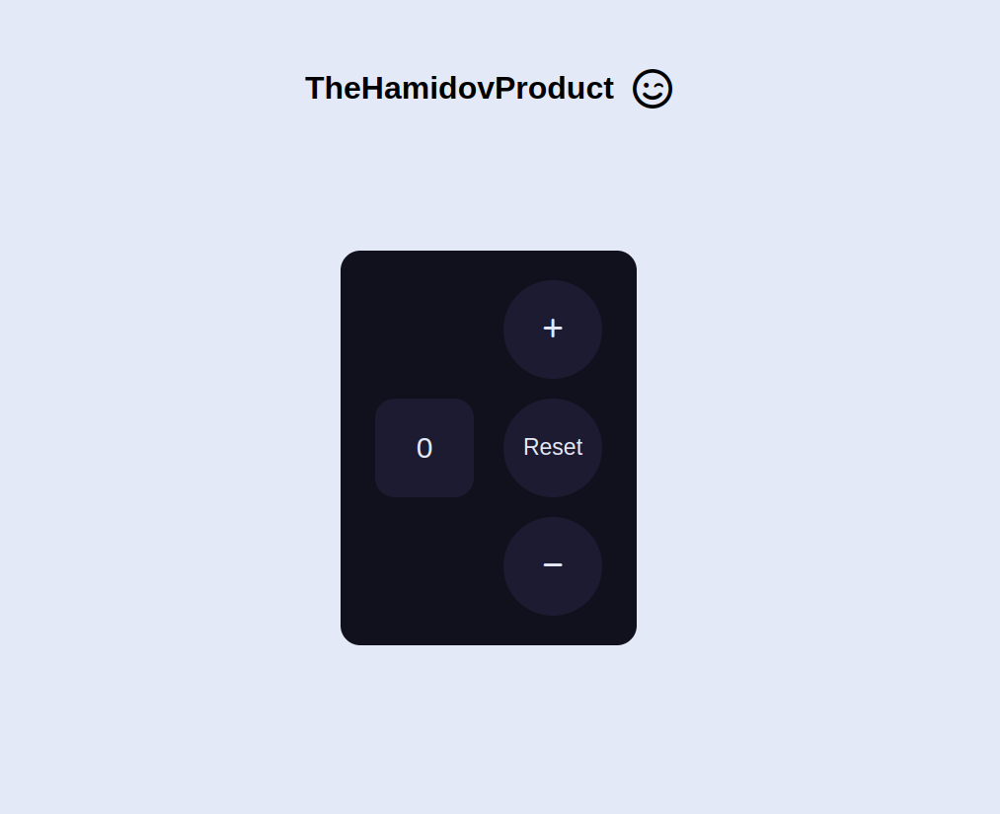

# Counter App 

This is a solution to the  Counter Project, that types of projects help  improve coding skills by building realistic projects. 

## Table of contents

- [Overview](#overview)
  - [Screenshot](#screenshot)
  - [Links](#links)
- [My process](#my-process)
  - [Built with](#built-with)
  - [Useful resources](#useful-resources)
- [Author](#author)

## Overview

### ScreenShot

### Links

- [Solution URL](https://github.com/RaviHamidov/Counter)
- [Live Site URL](https://ravihamidov.github.io/Counter/)

## My process

### Built with

- Technologys
  - HTML
  - CSS
  - JavaScript

### Note for Better UnderStanding

- All Project's code Organized I mean that Beautify, Readable, Understandable. 

- I use pure HTML & CSS only and write everything from scratch, 
  Don't used utilize any no code tools like Wix, Wordpress etc.

### Useful resources

- As Soon As ;)

## Author

- Website - [TheHamidov42]( thehamidov42.herokuapp.com)
- Twitter - [@RaviHamidov](https://www.twitter.com/@RaviHamidov)
- Instagram - [@RaviHamidov](https://www.instagram.com/ravihamidov/)